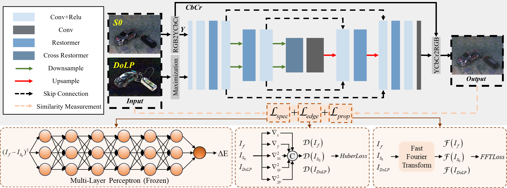

# CPIFuse: Toward realistic color and enhanced textures in color polarization image fusion

---
>Conventional image fusion aims to integrate multiple sets of source images into one with more details, representing the merging of intensity information. In contrast, polarization image fusion seeks to enhance texture of the intensity image S0 in the corresponding spectral bands by integrating strong texture features reflected by DoLP images, representing the combination of intensity and polarization, which are both physical properties of light. However, the 3-Dimensional information contained in DoLP is presented in a highlighted form within the 2-Dimensional image, and fusing it directly can result in spectrum discontinuities and obscuring necessary details of the fused image. Existing polarization image fusion methods do not analyze this phenomenon and fail to examine the physical information represented by DoLP images. Instead, they simply integrate this interference information in the same manner as fusing infrared images, leading to fused images that suffer from information loss and significant color discrepancies. In this paper, we propose a new color polarization image fusion strategy that takes into account the physical properties reflected in the S0 and DoLP images, namely CPIFuse. CPIFuse designs a customized loss function to optimize parameters through a lightweight Transformer-based image fusion framework, and color polarization image fusion has been achieved with color fidelity, enhanced texture and high efficiency. These advantages can be demonstrated in the visual effects, quantitative metrics, and car detection tasks of our comparative experiments. Furthermore, a new polarization dataset is constructed by the mechanism of division of focal plane polarimeter camera, which addresses the scarcity of datasets in the field of polarization image fusion.
>
---

## Update
- **2025.05.30**: CPIFuse_v1 is released.

## CPIF-Dataset
CPIF-dataset is released in this [link](https://pan.baidu.com/s/1TBPooiN_YhYvdm9zdEBZNw?pwd=2025)

## Requirements
```
conda create -n cpifuse python=3.12
conda activate cpifuse
pip install pytorch==2.5.1 torchvision==0.20.1 torchaudio==2.5.1 pytorch-cuda=11.8 -c pytorch -c nvidia
cd CPIFuse
pip install -r requirements.txt
python setup.py develop
```

## Inference
```
python ./inference.py
```

## Train
```
python ./train.py
```
The training results are stored in the "./Model/train_model" folder.

## References
If you find this repository useful for your research, please cite the following work.
```
@article{luo2025cpifuse,
  title={Toward realistic color and enhanced textures in color polarization image fusion},
  author={Luo, Yidong and Zhang, Junchao and Li, Chenggong},
  journal={Information Fusion},
  volume={120},
  pages={103111},
  year={2025},
  publisher={Elsevier}
}
